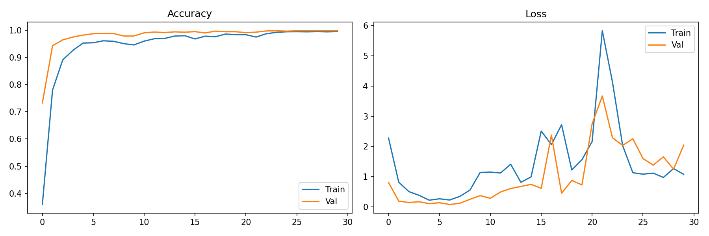
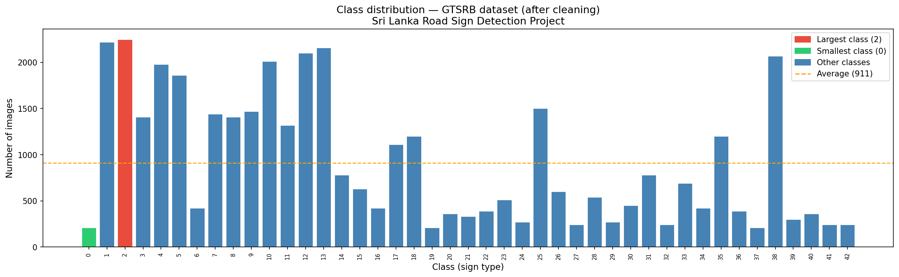

# 🚦 Traffic Sign Classification using Deep Learning

A Convolutional Neural Network (CNN) trained to classify **43 types of German traffic signs** from the GTSRB dataset with **97.70% test accuracy**, deployed as a Streamlit web application.

---

## 📋 Table of Contents
- [Project Overview](#project-overview)
- [Dataset](#dataset)
- [Project Structure](#project-structure)
- [Setup & Installation](#setup--installation)
- [How to Run](#how-to-run)
- [Model Architecture](#model-architecture)
- [Results](#results)
- [Web App](#web-app)
- [Technologies Used](#technologies-used)

---

## 🧠 Project Overview

This is a **supervised learning** image classification project that:
- Loads and preprocesses 39,209 road sign images across 43 classes
- Trains a CNN model using TensorFlow/Keras
- Evaluates on 12,630 test images
- Deploys as an interactive web app where users can upload a sign image and get an instant prediction

---

## 📦 Dataset

- **Name:** German Traffic Sign Recognition Benchmark (GTSRB)
- **Source:** [Kaggle](https://www.kaggle.com/meowmeowmeowme)
- **Training Images:** 39,209
- **Test Images:** 12,630
- **Classes:** 43

| Split | Images |
|-------|--------|
| Training (80%) | 31,367 |
| Validation (20%) | 7,842 |
| Test | 12,630 |

> ⚠️ The `data/` folder is excluded from Git due to size. Download the dataset from Kaggle and place it in `data/archive/`.

---

## 📁 Project Structure

```
road signs detection/
├── data/
│   └── archive/
│       ├── Train/          # Training images (class folders 0–42)
│       ├── Test/           # Test images
│       ├── Test.csv        # Test labels
│       └── preprocessed/  # Saved .npy arrays (auto-generated)
├── scripts/
│   ├── preprocessing_data.py   # Data loading & preprocessing pipeline
│   ├── train_model.py          # CNN model training
│   ├── app.py                  # Streamlit web app
│   ├── clean_data.py           # Data cleaning pipeline
│   ├── check_data.py           # Data validation
│   ├── requirements.txt        # Python dependencies
│   └── Traffic.h5              # Saved trained model
├── venv/                       # Virtual environment (excluded from Git)
├── .gitignore
└── README.md
```

---

## ⚙️ Setup & Installation

### Prerequisites
- macOS with Apple Silicon (M1/M2/M3) or Intel
- Python 3.11
- Homebrew

### 1. Clone the repository
```bash
git clone <your-repo-url>
cd "road signs detection"
```

### 2. Create virtual environment
```bash
python3.11 -m venv venv
source venv/bin/activate
```

### 3. Install dependencies
```bash
pip install -r scripts/requirements.txt
```

> 🍎 **Apple Silicon note:** The requirements file uses `tensorflow-macos` and `tensorflow-metal` instead of the standard `tensorflow` package.

---

## ▶️ How to Run

### Step 1 — Activate venv (always do this first!)
```bash
source venv/bin/activate
```

### Step 2 — Preprocess the data
```bash
python scripts/preprocessing_data.py
```

### Step 3 — Train the model
```bash
python scripts/train_model.py
```

### Step 4 — Launch the web app
```bash
streamlit run scripts/app.py
```
Then open **http://localhost:8501** in your browser.

### Stop the app
```bash
Ctrl + C
```

---

## 🏗️ Model Architecture

```
Input: (30, 30, 3)
│
├── Conv2D(32, 5×5, ReLU)
├── Conv2D(32, 5×5, ReLU)
├── MaxPooling2D(2×2)
├── Dropout(0.25)
│
├── Conv2D(64, 3×3, ReLU)
├── Conv2D(64, 3×3, ReLU)
├── MaxPooling2D(2×2)
├── Dropout(0.25)
│
├── Flatten
├── Dense(256, ReLU)
├── Dropout(0.5)
└── Dense(43, Softmax)

Optimizer : Adam (lr=0.001)
Loss      : Categorical Crossentropy
```

---

## 📊 Results

| Metric | Value |
|--------|-------|
| Test Accuracy | **97.70%** |
| Test Loss | 9.02 |
| Training Epochs | 30 |
| Batch Size | 32 |

### Training Curves


### Class Distribution


---

## 🌐 Web App

The Streamlit app allows users to:
- Upload any road sign image (JPG, PNG, PPM)
- Get the predicted sign name instantly
- See confidence percentage
- View Top 3 predictions with confidence bars

---

## 🛠️ Technologies Used

| Technology | Version | Purpose |
|------------|---------|---------|
| Python | 3.11.15 | Core language |
| TensorFlow / Keras | 2.16.2 | Model training |
| tensorflow-macos | 2.16.2 | Apple Silicon support |
| tensorflow-metal | 1.2.0 | GPU acceleration |
| NumPy | 1.26.4 | Array operations |
| Pandas | — | CSV handling |
| Pillow | — | Image loading |
| scikit-learn | — | Train/val split, metrics |
| Matplotlib | — | Training curves |
| Streamlit | — | Web app deployment |

---

## 🚧 Known Limitations

- Trained on **German road signs only** — may not recognise signs from other countries
- **Closed-set classifier** — always outputs one of 43 classes, cannot say "unknown"
- Class imbalance of **10.7x** between largest and smallest class

---

## 📚 References

- Dataset: GTSRB — German Traffic Sign Recognition Benchmark
- Tutorial reference: [DeepranjanG — Traffic Sign Classification](https://github.com/DeepranjanG/Traffic_sign_classification)

---

## 👩‍💻 Author

**Amandasewwandi**
Sri Lanka — Semester 6 Deep Learning Assignment